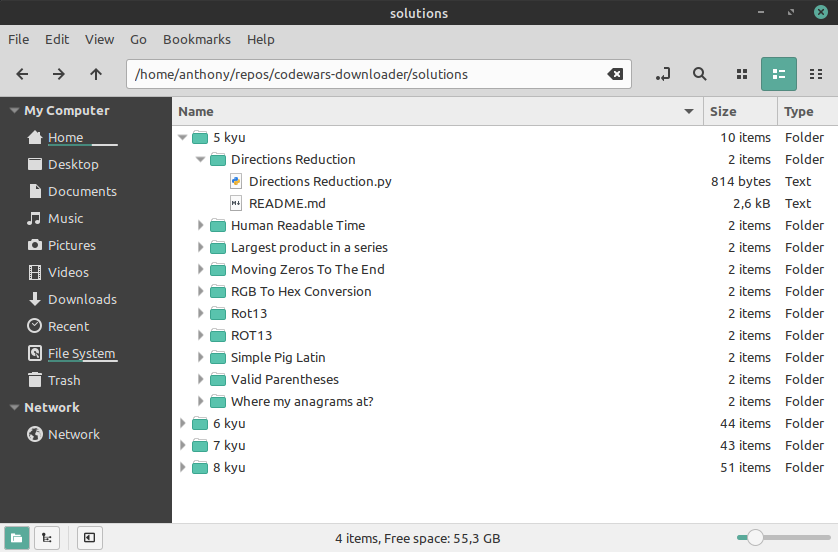

# Codewars Downloader

A downloader for Codewars kata solutions.



## How to use

### Setup

Clone the project repository:

```git clone https://github.com/anthonyjatoba/codewars-downloader.git```

Create a virtual environment and install the dependencies:

```
python3 -m venv venv
source venv/bin/activate
pip install -r requirements.txt
```

This project relies on Selenium to fetch the solutions code, so it is necessary to install the driver for your browser. Refer to [Selenium - Drivers](https://selenium-python.readthedocs.io/installation.html#drivers) for instructions on how to install the driver in your system.

Currently, we support **Chrome** and **Firefox**.

### Configuration

All configuration is performed through the [config.ini](config.ini) file. See below how to set up

```
[codewars]
username = <your username>
email = <your email>
password = <your password>

[settings]
scroll_delay = 2 # increase if not enough to load the pages
browser = <chrome|firefox>
directory = solutions # change to save in another directory
```

### Running

Run with:

```python3 codewars_downloader.py```